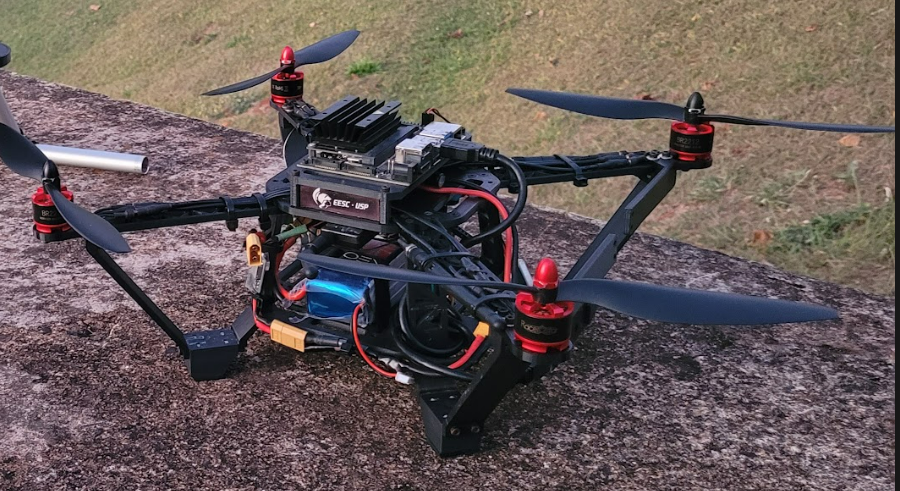

# harpia-navigation

Descrição do Sistema de Navegação do drone Harpia, da Equipe Atena, para a CBR 2024.

## O Drone Harpia
Em 2024, o [Grupo SEMEAR](https://github.com/Grupo-SEMEAR-USP) irá participar da CBR 2024, mais especificamente, da Flying Robot Trial League, que ocorrerá em Goiânia-GO nos dias 11 a 17 de novembro deste ano. 

O Drone que a equipe levará para a competição foi batizado de ```Harpia```, em homenagem à famosa ave de rapina brasileira. No ano de 2024, a Equipe Atena, do  Grupo SEMEAR, irá trazer uma versão remodelada e aprimorada do Harpia que foi à mesma competição em 2023.

<p align="center">
  
</p>
<p align="center">
  <span style="font-size: 12px;">Drone Harpia</span>
</p>


## Navegação e Controle

O sistema de navegação e controle do drone Harpia é baseado no framework Clover, desenvolvido pela COEX. Este framework utiliza o firmware PX4 na controladora de voo PixHawk, proporcionando uma interface intuitiva para o controle do drone. 

### Sistema de Navegação

O framework Clover é integrado ao ROS (Robot Operating System), o que permite um controle de alto nível dos parâmetros do drone. Este sistema facilita a implementação de funções complexas, como a função ```navigate```, que é essencial para a navegação precisa do drone. Essa função permite que o drone se mova para um ponto específico no espaço, utilizando um determinado referencial para todas as suas movimentações subsequentes.

Quando um comando é enviado para mover o drone para um ponto específico, o sistema de controle do Clover gera automaticamente os setpoints necessários. Esses setpoints são então transmitidos para a controladora de voo PixHawk, que repassa as informações para os ESCs (Electronic Speed Controllers) e motores do drone. Este processo garante que o drone alcance precisamente a posição desejada.

### Obtenção de Telemetria e Mapeamento

O framework Clover facilita a obtenção de telemetria do drone, o que é crucial para o controle de posição. A precisão dos cálculos realizados pela PX4, com base na IMU (Unidade de Medição Inercial) e na odometria visual, permite uma determinação precisa da posição do drone. 

Com a telemetria e informações antecipadas sobre as dimensões do espaço, o drone pode mapear e navegar na arena de forma eficaz. Os pontos relevantes obtidos são inseridos no mapa em relação à posição atual do drone, proporcionando uma visão abrangente do ambiente. 

### Recursos Adicionais

Para mais detalhes sobre o Clover, suas funcionalidades e como utilizá-lo, consulte o [repositório oficial no GitHub](https://github.com/CopterExpress/clover).

### Exemplo de Código para Navegação

Neste repositório, pode-se encontrar um exemplo de como implementar a função de navegação utilizando o framework Clover. O exemplo mostra como decolar, mover e pousar o drone utilizando os serviços oferecidos pelo pacote.